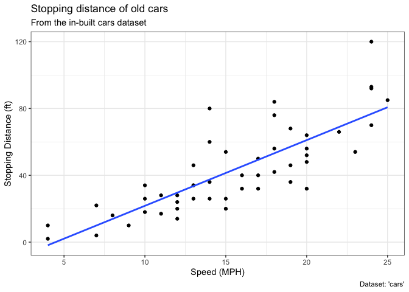
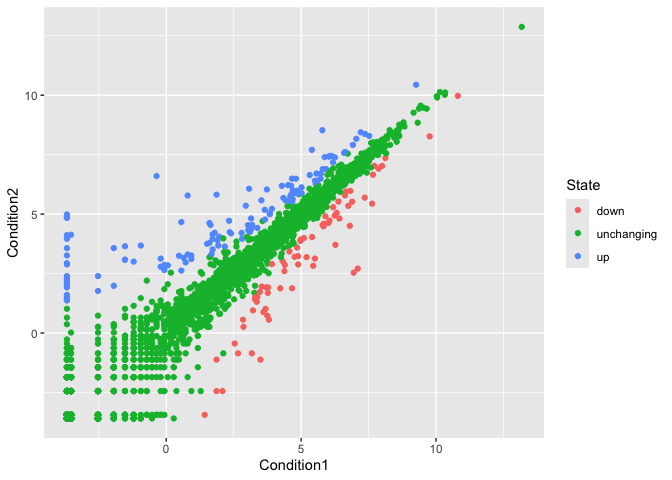
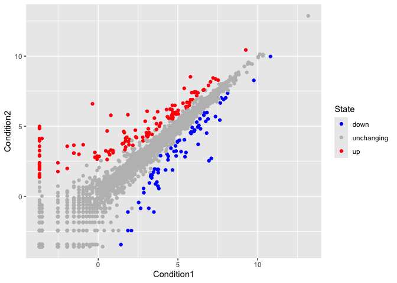
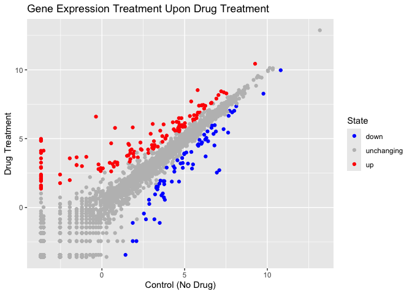
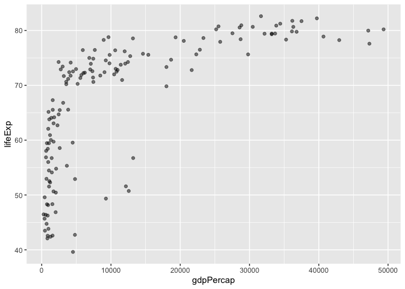
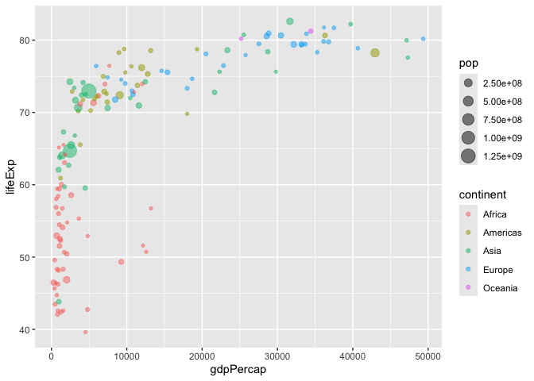
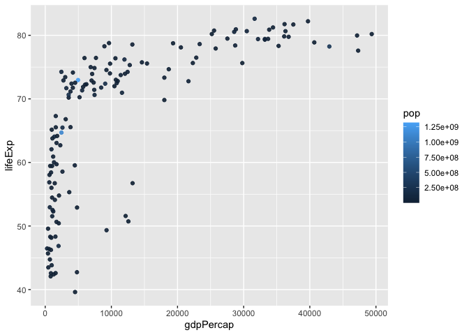
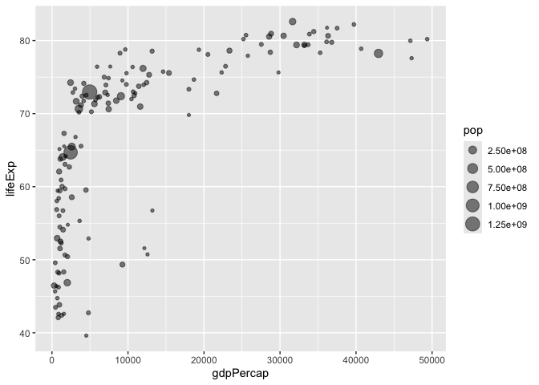
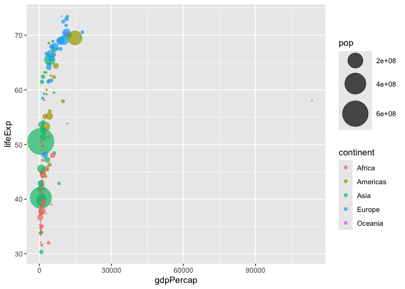
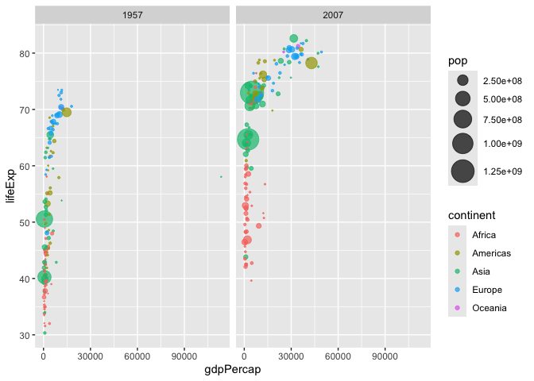

# Class 5: database with ggplot
Longmei A17012012

> Q1. For which phases is data visualization important in our scientific
> workflows?

All of the above

> Q2. True or False? The ggplot2 package comes already installed with R?

FALSE

> Q3. Which plot types are typically NOT used to compare distributions
> of numeric variables?

Network Graphs

> Q4. Which statement about data visualization with ggplot2 is
> incorrect?

ggplot2 is the only way to create graphs in R

## Plotting in R

R has lots of ways to make plots and figures. This includes so-called
**base** graphics and packages like **ggplots**

``` r
plot(cars)
```


This is a **base** R plot of the in-built `dataset` dataset that has
only two columns

``` r
head(cars)
```

      speed dist
    1     4    2
    2     4   10
    3     7    4
    4     7   22
    5     8   16
    6     9   10

> Q. how would we plot this data with **ggplot** ?

All ggplot figures have at least 3 layers:

- **data**
- **aesthetics** (how the data map to the plot)
- **geometry** (how we draw the plot)

before using any new packag, need to download and instal it with the
`install.packages()` command.

Never use `install.packages()` within my quarto document otherwise it
will install the package over and over again.

Once a package is installed I can load it up with the `library()`
function.

``` r
library(ggplot2)
ggplot(cars) +
  aes(x=speed, y=dist) + 
  geom_point()
```


**Key-point**: for simple plot (like the one above), ggplot is more
verbose (we need to do more typing) but as plot get more complicated
ggplot starts to be more vlear and simple than base E plot()

> Q. Which geometric layer should be used to create scatter plots in
> ggplot2?

geom_point()

> Q. In your own RStudio can you add a trend line layer to help show the
> relationship between the plot variables with the geom_smooth()
> function?

Yes I can add another layer of Geom.

> Q. Argue with geom_smooth() to add a straight line from a linear model
> without the shaded standard error region?

Adding the argument `method = "lm"` would change the line to a straight
line, and adding the argument `se = FALSE` would remove the shaded
standard error region.

> Q. Can you finish this plot by adding various label annotations with
> the labs() function and changing the plot look to a more conservative
> “black & white” theme by adding the theme_bw() function:

Yes, I can add arguments such as `title`, `subtitle`, `caption`, `x`,
`y` in the `labs()` function. I can as the `theme_bw()` function to
change the theme to black and white.

``` r
ggplot(cars) +
  aes(speed, dist) + 
  geom_point() +
  geom_smooth(se = FALSE, method = "lm") +
  labs(title = "Stopping distance of old cars", 
       subtitle = "From the in-built cars dataset",
       x ="Speed (MPH)",
       y ="Stopping Distance (ft)",
       caption ="Dataset: 'cars'") +
  theme_bw()
```

    `geom_smooth()` using formula = 'y ~ x'



## Adding more plot aesthetic

``` r
##loading gene information
url <- "https://bioboot.github.io/bimm143_S20/class-material/up_down_expression.txt"
genes <- read.delim(url)
head(genes)
```

            Gene Condition1 Condition2      State
    1      A4GNT -3.6808610 -3.4401355 unchanging
    2       AAAS  4.5479580  4.3864126 unchanging
    3      AASDH  3.7190695  3.4787276 unchanging
    4       AATF  5.0784720  5.0151916 unchanging
    5       AATK  0.4711421  0.5598642 unchanging
    6 AB015752.4 -3.6808610 -3.5921390 unchanging

> Q. Use the nrow() function to find out how many genes are in this
> dataset. What is your answer?

``` r
nrow(genes)
```

    [1] 5196

There are 5196 genes in this dataset, each represented by a row.

> Use the colnames() function and the ncol() function on the genes data
> frame to find out what the column names are (we will need these later)
> and how many columns there are. How many columns did you find?

``` r
colnames(genes)
```

    [1] "Gene"       "Condition1" "Condition2" "State"     

``` r
ncol(genes)
```

    [1] 4

The column names are “Gene”, “Conditional”, “Condition2”, and “State”.
There are 4 columns in total.

> Q. Use the table() function on the State column of this data.frame to
> find out how many ‘up’ regulated genes there are. What is your answer?

``` r
table(genes$State)
```


          down unchanging         up 
            72       4997        127 

There are 127 up regulated genes

> Q. Using your values above and 2 significant figures. What fraction of
> total genes is up-regulated in this dataset?

``` r
round(table(genes$State) / nrow(genes), 2)
```


          down unchanging         up 
          0.01       0.96       0.02 

2% of the genes are up-regulated in this dataset.

> Q. Complete the code below to produce the following plot

``` r
ggplot(genes) +
  aes(x=Condition1, y=Condition2) +
  geom_point()
```


``` r
p <- ggplot(genes) +
  aes(x=Condition1, y=Condition2, col = State) +
  geom_point()
p
```



``` r
p <- p + scale_color_manual(values = c("blue", "grey", "red"))
p
```



> Q. Nice, now add some plot annotations to the p object with the labs()
> function so your plot looks like the following:

``` r
p + 
  labs(title = "Gene Expression Treatment Upon Drug Treatment",
      x = "Control (No Drug)",
      y = "Drug Treatment")
```



## Going Further

``` r
# File location online
url <- "https://raw.githubusercontent.com/jennybc/gapminder/master/inst/extdata/gapminder.tsv"
gapminder <- read.delim(url)
library(dplyr)
```


    Attaching package: 'dplyr'

    The following objects are masked from 'package:stats':

        filter, lag

    The following objects are masked from 'package:base':

        intersect, setdiff, setequal, union

``` r
gapminder_2007 <- gapminder %>% filter(year==2007)

head(gapminder_2007)
```

          country continent year lifeExp      pop  gdpPercap
    1 Afghanistan      Asia 2007  43.828 31889923   974.5803
    2     Albania    Europe 2007  76.423  3600523  5937.0295
    3     Algeria    Africa 2007  72.301 33333216  6223.3675
    4      Angola    Africa 2007  42.731 12420476  4797.2313
    5   Argentina  Americas 2007  75.320 40301927 12779.3796
    6   Australia   Oceania 2007  81.235 20434176 34435.3674

``` r
table(gapminder$year)
```


    1952 1957 1962 1967 1972 1977 1982 1987 1992 1997 2002 2007 
     142  142  142  142  142  142  142  142  142  142  142  142 

> Q. Complete the code below to produce a first basic scater plot of
> this gapminder_2007 dataset:

``` r
ggplot(gapminder_2007) +
  aes(x = gdpPercap, y= lifeExp) +
  geom_point(alpha=0.5)
```



``` r
ggplot(gapminder_2007) +
  aes(x = gdpPercap, y= lifeExp, color=continent, size=pop) +
  geom_point(alpha=0.5)
```



color the points by numerical value population pop:

``` r
ggplot(gapminder_2007) + 
  aes(x = gdpPercap, y = lifeExp, color = pop) +
  geom_point(alpha=0.9)
```



Adjusting point size: to reflect the actual population differences with
the point sizes, we use the `scale_size_area()` function.

``` r
ggplot(gapminder_2007) + 
  geom_point(alpha=0.5) + 
  aes(x = gdpPercap, y = lifeExp, size = pop)
```



``` r
  scale_size_area(max_size = 10)
```

    <ScaleContinuous>
     Range:  
     Limits:    0 --    1

-Q. Can you adapt the code you have learned thus far to reproduce our
gapminder scatter plot for the year 1957? What do you notice about this
plot is it easy to compare with the one for 2007?

``` r
gapminder_1957 <- gapminder %>% filter(year==1957)
head(gapminder_1957)
```

          country continent year lifeExp      pop gdpPercap
    1 Afghanistan      Asia 1957  30.332  9240934   820.853
    2     Albania    Europe 1957  59.280  1476505  1942.284
    3     Algeria    Africa 1957  45.685 10270856  3013.976
    4      Angola    Africa 1957  31.999  4561361  3827.940
    5   Argentina  Americas 1957  64.399 19610538  6856.856
    6   Australia   Oceania 1957  70.330  9712569 10949.650

``` r
ggplot(gapminder_1957) +
  aes(x = gdpPercap, y=lifeExp, color = continent, size = pop) +
  geom_point(alpha = 0.7) +
    scale_size_area(max_size = 15)
```



It is not that easily comparable with the plot for 2007 since the scale
for x and y axis are different, making it hard to directly visualize the
differences.

``` r
gapminder_comb = gapminder %>% filter(year==1957 | year==2007)
ggplot(gapminder_comb) +
  aes(x = gdpPercap, y=lifeExp, color = continent, size = pop) +
  geom_point(alpha = 0.7) +
    scale_size_area(max_size = 10) +
      facet_wrap(~year)
```


