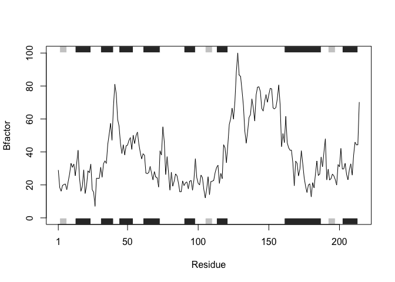
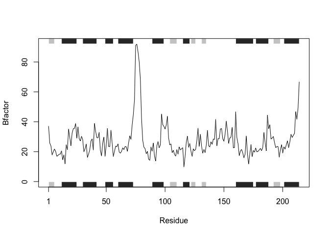
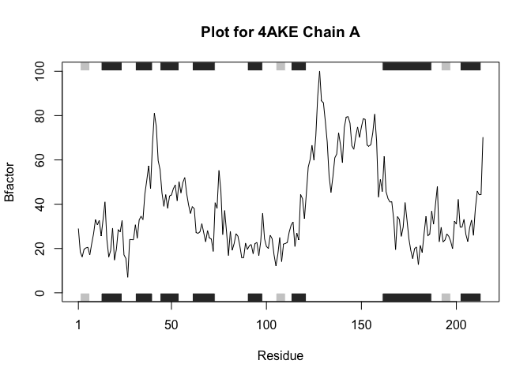
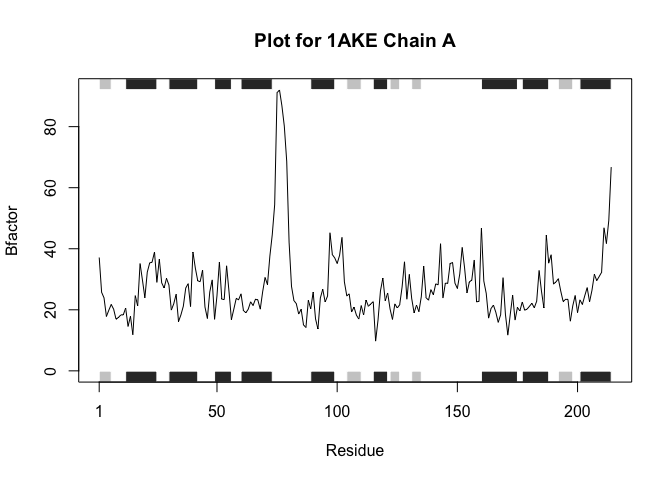
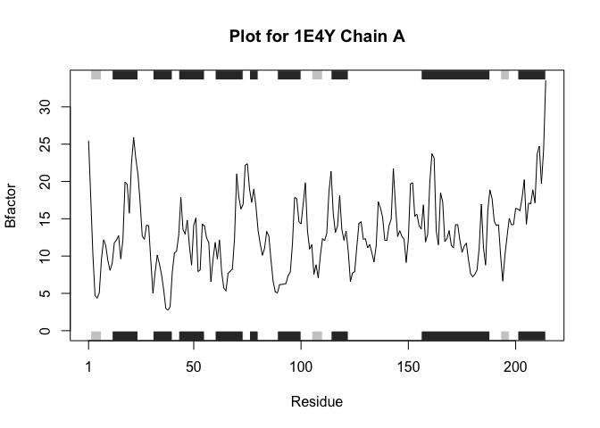

# Lecture6_homework


need to install package `bio3d` with the function `install.packages()`.

## Original Code

Running the original code snippet to understand the functions, inputs,
and outputs. This code takes the pdb protein id, the chain, and the
element type to isolate the B factors for this protein at that specific
chain. It generates a plot for B-factor along with the chain of protein

``` r
library(bio3d)
```

    Warning: package 'bio3d' was built under R version 4.3.3

``` r
s1 <- read.pdb("4AKE") # kinase with drug
```

      Note: Accessing on-line PDB file

``` r
s2 <- read.pdb("1AKE") # kinase no drug
```

      Note: Accessing on-line PDB file
       PDB has ALT records, taking A only, rm.alt=TRUE

``` r
s3 <- read.pdb("1E4Y") # kinase with drug
```

      Note: Accessing on-line PDB file

``` r
s1.chainA <- trim.pdb(s1, chain="A", elety="CA")
s2.chainA <- trim.pdb(s2, chain="A", elety="CA")
s3.chainA <- trim.pdb(s1, chain="A", elety="CA")
s1.b <- s1.chainA$atom$b
s2.b <- s2.chainA$atom$b
s3.b <- s3.chainA$atom$b
plotb3(s1.b, sse=s1.chainA, typ="l", ylab="Bfactor")
```



``` r
plotb3(s2.b, sse=s2.chainA, typ="l", ylab="Bfactor")
```



``` r
plotb3(s3.b, sse=s3.chainA, typ="l", ylab="Bfactor")
```


## Writing the Function

This code combines the steps from the previous code into a single
function. The function takes three inputs: the protein PDB ID, the chain
to focus on, and the element type. Similar to the previous approach, the
function outputs a plot of B-factors. However, by using this function,
we avoid repeating the same steps for each protein. Instead, we simply
pass the relevant parameters for each protein to the function and get
the desired plot.

``` r
##Define function protein_analysis() that read the sequences and analyze their structure
protein_analysis <- function(pdb_id, chain_input="A", elety_input="CA"){
  
  ##read the protein sequence from PDB
  seq <- read.pdb(pdb_id)
  
  ##trim the sequence to focus on specific chain and element type
  seq.chainA <- trim.pdb(seq, chain = chain_input, elety = elety_input)
  
  ##isolate b-factors from chain A of sequence
  seq.b <- seq.chainA$atom$b
  
  ##plot b-factor vs. chainA
  plotb3(seq.b, sse=seq.chainA, typ="l", ylab="Bfactor", main=paste("Plot for", pdb_id, "Chain", chain_input))
  
}
```

Testing the function:

``` r
protein_analysis("4AKE", chain_input = "A", elety_input = "CA")
```

      Note: Accessing on-line PDB file

    Warning in get.pdb(file, path = tempdir(), verbose = FALSE):
    /var/folders/fr/phzdrrgx3wj4frmr82btkq2w0000gn/T//RtmpAX9dNM/4AKE.pdb exists.
    Skipping download



``` r
protein_analysis("1AKE", "A", "CA")
```

      Note: Accessing on-line PDB file

    Warning in get.pdb(file, path = tempdir(), verbose = FALSE):
    /var/folders/fr/phzdrrgx3wj4frmr82btkq2w0000gn/T//RtmpAX9dNM/1AKE.pdb exists.
    Skipping download

       PDB has ALT records, taking A only, rm.alt=TRUE



``` r
protein_analysis("1E4Y")
```

      Note: Accessing on-line PDB file

    Warning in get.pdb(file, path = tempdir(), verbose = FALSE):
    /var/folders/fr/phzdrrgx3wj4frmr82btkq2w0000gn/T//RtmpAX9dNM/1E4Y.pdb exists.
    Skipping download


